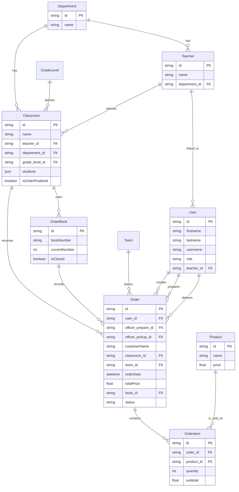

# NVCCake Project 🍰

ระบบบริหารจัดการการสั่งจองและส่งมอบเค้ก (Cake Management System) สำหรับสถานศึกษา พัฒนาด้วย **Bun**, **ElysiaJS**, **Prisma (PostgreSQL)** ในส่วนของ Backend และ **React 19**, **Vite**, **TanStack Router/Query** ในส่วนของ Frontend

---

## 🚀 Tech Stack

### Backend
- **Runtime:** [Bun](https://bun.sh/)
- **Framework:** [ElysiaJS](https://elysiajs.com/)
- **Database ORM:** [Prisma](https://www.prisma.io/) (PostgreSQL)
- **Validation:** [Biome](https://biomejs.dev/)
- **Documentation:** Swagger (at `/docs`)
- **Other:** Husky, Commitlint, ExcelJS, Node-cron

### Frontend
- **Framework:** [React 19](https://react.dev/)
- **Build Tool:** [Vite](https://vitejs.dev/)
- **Routing:** [TanStack Router](https://tanstack.com/router)
- **State Management:** [TanStack Query](https://tanstack.com/query)
- **Styling:** [Tailwind CSS v4](https://tailwindcss.com/)
- **UI Components:** Radix UI, Lucide Icons, Shadcn UI (inspired)
- **Charts:** Chart.js
- **Animations:** Framer Motion

---

## 📊 Database Schema (Mermaid)



---

## 🛠️ Getting Started

### Prerequisites
- [Bun](https://bun.sh/) (แนะนำ) หรือ Node.js (v20+)
- [Docker](https://www.docker.com/) (สำหรับ Database)

### 1. Database Setup
```bash
cd backend
# ตรวจสอบ .env และตั้งค่า DATABASE_URL
docker-compose up -d
bun prisma migrate dev
```

### 2. Backend Setup
```bash
cd backend
bun install
bun run dev
```
Backend จะทำงานที่ `http://localhost:3000` และ Swagger Docs ที่ `http://localhost:3000/docs`

### 3. Frontend Setup
```bash
cd frontend
# สร้าง .env และตั้งค่า VITE_APP_API_URL=http://localhost:3000
npm install
npm run dev
```
Frontend จะทำงานที่ `http://localhost:5173`

---

## 📂 Project Structure

```text
nvccake_project/
├── backend/            # ElysiaJS + Prisma + Bun
│   ├── prisma/         # Database schema & migrations
│   ├── src/
│   │   ├── features/   # Business logic & controllers
│   │   ├── providers/  # Database & Logger providers
│   │   └── shared/     # Middleware & Utils
├── frontend/           # React + Vite + TypeScript
│   ├── src/
│   │   ├── components/ # Reusable UI components
│   │   ├── pages/      # Page components
│   │   ├── hooks/      # Custom React hooks
│   │   ├── contexts/   # React Context API
│   │   └── types/      # TypeScript definitions
```

---

## ✨ Features

- **RBAC:** ระบบจัดการบทบาท (SuperAdmin, Admin, Officer, User)
- **Order Management:** การจัดการคำสั่งซื้อเค้กและการพิมพ์ใบเสร็จ (JSBarcode)
- **Team Management:** รองรับการสั่งในนามกลุ่มหรือรายบุคคล
- **Real-time Dashboard:** แสดงสถิติการขายด้วย Chart.js
- **Print System:** รองรับการพิมพ์ใบสั่งจองและใบรับเค้ก
- **Academic Year Isolation:** แยกข้อมูลตามปีการศึกษาผ่าน Header `x-academic-year`
